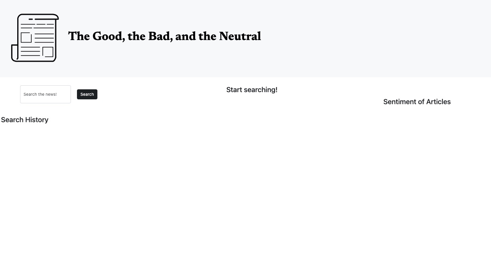

# The Good, the Bad, and the Neutral 

## Description

One of the basic principles of journalism is impartiality, but in practice this can be difficult to maintain. As such most news articles demonstrate some sort of positive or negative sentiment. With our website, the good, the bad and the neutral you can find articles relating to a particular subject and whether they are generally positive, negative or neutral. 

## Installation

Please visit site [here](https://aimeedarling.github.io/GBN/) and visit the repo [here](https://github.com/aimeedarling/GBN)

## Usage

Screenshot of site

## Credits

Collaborators  GitHub profiles.

[Lukas](https://github.com/mastalukeremix) 

[Nishat](https://github.com/NishatMiah) 

[Aimee](https://github.com/aimeedarling)

Reference Material

[README guide](https://coding-boot-camp.github.io/full-stack/github/professional-readme-guide)

Oston Code Cypher [youtube](https://www.youtube.com/watch?v=hfKzh0IhtpY) and [google drive](https://drive.google.com/drive/folders/1mAsmbneFg4rJlkAeSg1JtVyUyOwMvF7e)

[ChatGPT](https://openai.com/blog/chatgpt)

## License
Please see license in repo
